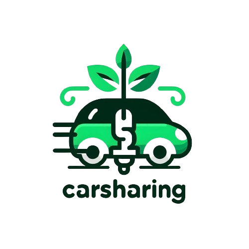

# CarSharing

## Manual de Despliegue
### Despliegue en Google Cloud
Acceder a la aplicación desplegada en Google Cloud:
- URL: http://34.163.13.158:8080/

Descripción: La aplicación está hospedada en una máquina virtual en Google
Cloud. Acceder a la URL proporcionada abre la aplicación para su uso.
### Despliegue con Imágenes Docker
#### Descarga de imágenes desde el repositorio remoto
- Instalar Docker en local si no está instalado.
- Ejecutar los siguientes comandos para descargar las imágenes del repositorio
remoto:

docker pull dancorfon/carsharing_us:carsharing_database-v1.0

docker pull dancorfon/carsharing_us:carsharing_backend-v1.0

docker pull dancorfon/carsharing_us:carsharing_frontend-v1.0

Descripción: Las imágenes de la base de datos, backend y frontend están
disponibles en el repositorio remoto. Estas deben ser descargadas usando docker
pull antes de proceder con el despliegue. (En caso de que una vez que se despliegue el contenedor 
salte un error de que los puertos no esten disponibles finalizar la tarea de MySQL en el administrador de tareas).

#### Ejecución del proyecto con Docker Compose
- Descargar el proyecto localmente.
- Navegar al directorio del proyecto y ejecutar:
  
docker-compose up -d

Descripción: Utiliza el archivo docker-compose.yml para levantar los servicios
utilizando las imágenes previamente descargadas de Docker Hub. Los servicios
incluyen la base de datos, backend y frontend.

#### Construyendo Imágenes Locales
Otra manera que hay sin que haya que descargar las imágenes de Docker Hub
es descargar el proyecto y ejecutar el comando docker-compose up –build -d. Esto
hará que el archivo de configuración docker-compose.yml busque las imágenes en el
equipo y, como no las contendrá, las creará nuevas a partir de los Dockerfile creados.
- Descarga el proyecto y ejecuta:
	- docker-compose up --build -d
- El archivo docker-compose.yml buscará las imágenes en tu equipo. Si no las
encuentra, creará nuevas a partir de los Dockerfile proporcionados en el
proyecto.

### Despliegue en Local
#### Clonar el repositorio desde GitHub
git clone https://github.com/carsharingUS/carsharing.git
Descripción: Clonar el repositorio que contiene el proyecto carsharing desde
GitHub.
#### Preparación del entorno local
- Crear y activar un entorno virtual de Python.
- Instalar las dependencias listadas en requirements.txt.
  
python -m venv venv

source venv/bin/activate # En sistemas Linux/Mac

pip install -r requirements.txt

Descripción: Configurar el entorno de desarrollo local para ejecutar la aplicación
Python.

####  Configuración de MySQL
Crear manualmente el usuario y la base de datos necesarios:

- Usuario: carsharinguser
- Contraseña: 2329
- Base de datos: carsharing

Descripción: Configurar MySQL localmente para que la aplicación pueda
conectarse correctamente.

#### Iniciar el backend
- Navegar al directorio carsharing que contiene settings.py y modificar el
apartado de HOST a localhost.
- Ejecutar los comandos de migración y ejecución del servidor:
  
python manage.py makemigrations

python manage.py migrate

python manage.py runserver

Descripción: Preparar y ejecutar el backend Django. Realizar las migraciones
necesarias en la base de datos.
#### Iniciar el frontend
- Navegar al directorio carsharing_client.
- Instalar Vite y asegurarse de tener Node.js v20.10.0 (o la versión requerida):
- 
npm install -g create-vite@latest

nvm install 20.10.0

- Instalar dependencias y ejecutar el servidor de desarrollo:
  
npm install

npm run dev

Descripción: Configurar y ejecutar el frontend Vue.js. Asegurarse de que el
frontend se conecte correctamente con el backend.
### Notas Finales
- Asegúrate de seguir cada paso con cuidado para garantizar un despliegue
exitoso de la aplicación en el entorno elegido.
- Actualiza las URLs y versiones específicas según las necesidades y
configuraciones de tu aplicación.

Este manual proporciona una guía detallada y estructurada para desplegar la
aplicación en Google Cloud, con Docker y en un entorno local, cubriendo cada paso
necesario para cada opción de despliegue.
